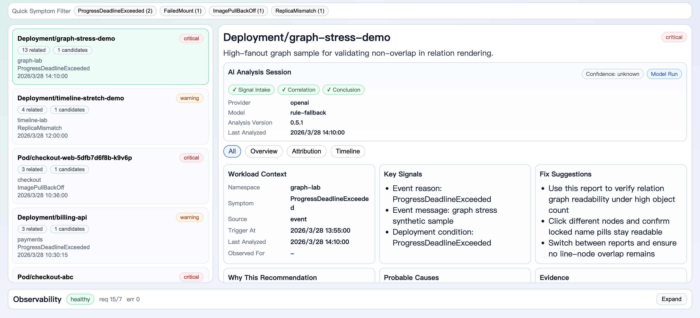
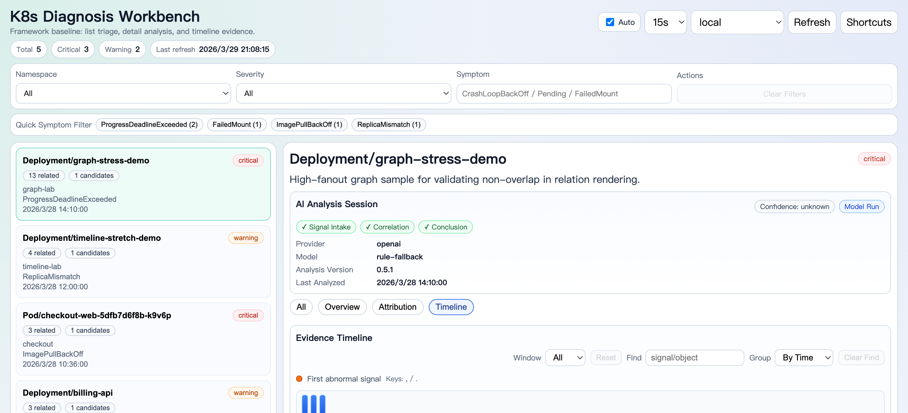
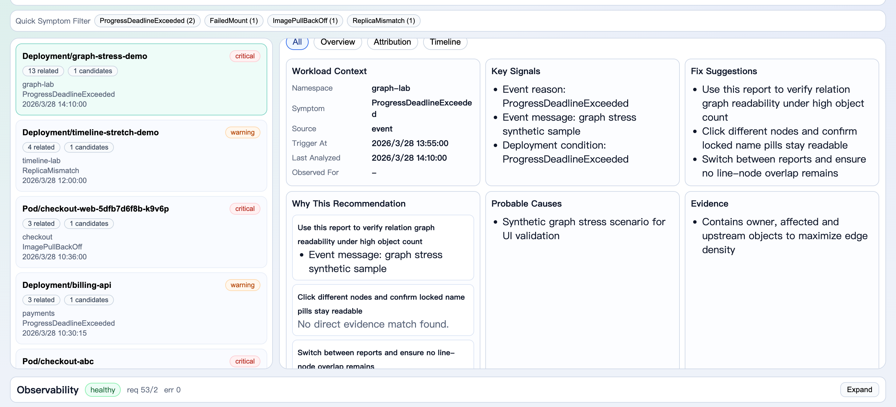
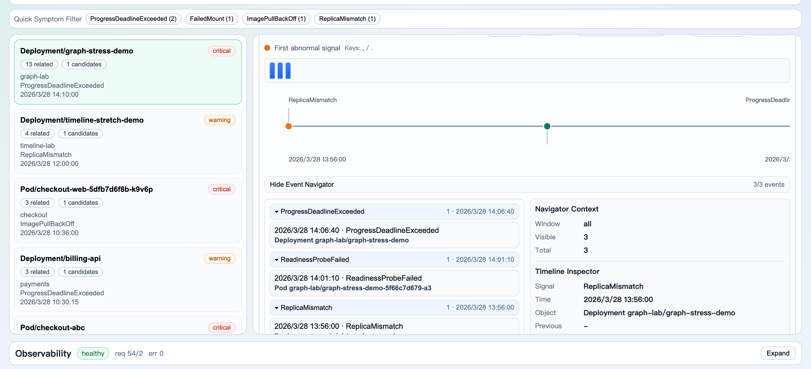

# v0.5.2 (Planned) - UX + AI Analysis Experience

This document introduces the planned `v0.5.2` patch release with a focus on:

- higher information density for operators
- larger diagnosis detail workspace
- clearer "AI is actively analyzing" feedback in the UI

## 1. Compact Workbench Layout

What changed:

- top bar and stats strip are compressed to reclaim vertical space
- list/detail workspace is adjusted to `30/70` by default
- large screens use a detail-first split (`24/76`)

Why it matters:

- complex reports are visible earlier above the fold
- less context switching and less frequent scrolling

Focused feature shot:

## 2. AI Analysis Session Card

A new detail card makes the model run transparent:

- provider / model shown directly in detail
- fallback state shown (`Model Run` vs `Fallback`)
- stage progress shown:
  - `Signal Intake`
  - `Correlation`
  - `Conclusion`
- confidence badge and analysis metadata included

Why it matters:

- operators can tell if this is model-based analysis or fallback output
- the analysis path is understandable, not a black box

Focused feature shot:

## 3. Recommendation-to-Evidence Mapping

A new `Why This Recommendation` block links each suggestion to supporting evidence snippets.

Behavior:

- when evidence overlaps semantically, top evidence lines are shown
- when no direct match is found, UI explicitly says so

Why it matters:

- recommendations become auditable
- easier to trust and execute remediation steps

Focused feature shot:

## 4. Timeline + Attribution Context (Improved Readability)

The release keeps timeline and relation context visible and aligned with the AI session:

- relation graph and top root candidate remain in the same detail flow
- event navigator can be expanded to inspect grouped timeline signals

Focused feature shot:

## 5. Included Reliability Fixes

`v0.5.2` includes prior UI stability fixes merged before release:

- legacy report detail fallback no longer blanks the detail panel when detail fetch fails
- hook-order fix for timeline rendering prevents React crash when switching reports with/without timeline data

## 6. Validation Checklist

- frontend unit tests pass (`vitest`)
- frontend e2e tests pass (`playwright`)
- browser verification:
  - March 27 reports no longer blank the page
  - AI Analysis Session card renders on detail view
  - compact layout and wider detail panel are active
